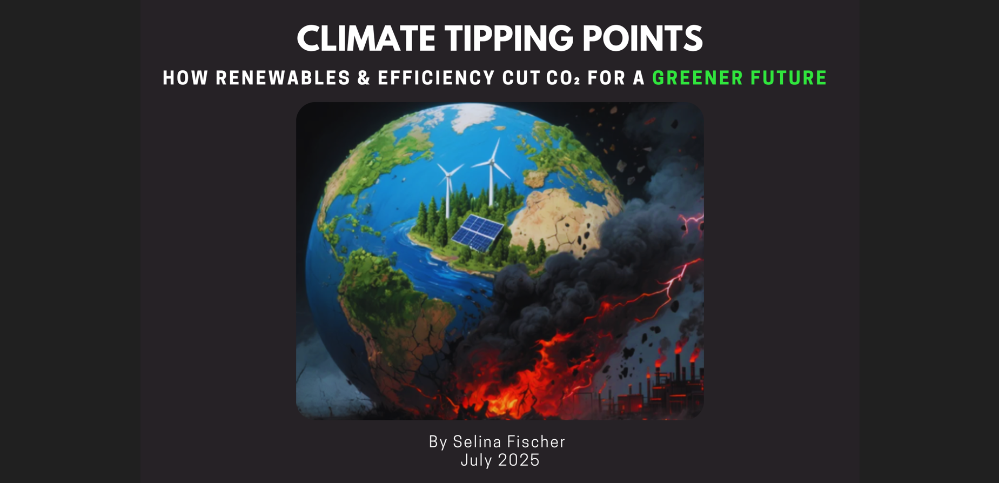

### Introduction & Motivation

As climate urgency grows, the European Union has raised its renewable energy targets — from **32% by 2030** under the *Recast Renewable Energy Directive (2018/2001/EU)* to **at least 42.5%**, with an ambition to reach **45%**, under the *Revised Renewable Energy Directive (EU/2023/2413)*  
([source](https://energy.ec.europa.eu/topics/renewable-energy/renewable-energy-directive-targets-and-rules/renewable-energy-targets_en)).

But are these thresholds enough to trigger meaningful decarbonisation?

In this independent project, I investigate **climate tipping points** — moments when renewable energy adoption and efficiency improvements begin to produce measurable reductions in CO₂ emissions. Using global datasets, I apply statistical validation and interactive visualisation to identify key drivers accelerating or hindering the path to net zero.

The analysis explores:
- Whether exceeding a 30% renewables share represents a tipping point in emissions per capita,
- The role of energy efficiency and financial flows in influencing decarbonisation,
- And which regions are advancing — or lagging — in the energy transition.

The aim is to transform complex data into practical insights that highlight where climate action is taking hold — and where greater momentum is needed.


### Project Objectives

- Quantify how renewable energy adoption and energy efficiency relate to CO₂ emissions across countries and over time.
- Detect structural **tipping points** — thresholds where emission reductions begin to accelerate.
- Deliver actionable insights through an interactive dashboard designed to support policy decisions and further research.


### Business Case

Uneven global progress on decarbonisation highlights the need for data-driven insights to guide investments and policies where they can deliver the greatest impact.


### Project Overview

This project analyses and visualises the key drivers influencing sustainable energy transitions and climate outcomes across countries — identifying where and how tipping points for positive change can be reached. It combines data analytics, statistical validation, and an interactive Streamlit dashboard to equip decision-makers and the public with clear, actionable insights.


### Problem Statement

Despite global commitments through initiatives like the EU Green Deal and COP28, progress toward decarbonisation remains uneven. Key drivers such as GDP, population, economic development, energy policy, and energy efficiency vary significantly across countries and regions. This project uncovers these disparities and identifies tipping points where climate action begins to accelerate.


### Project Plan

**Tools & Workflow:**  
- GitHub repo with Kanban board for task tracking  
- Development and analysis in VS Code  
- Deployment via Streamlit Community Cloud  

**High-Level Agile Project Plan (5 Days)**

| Day   | Tasks                                                                 |
|-------|-----------------------------------------------------------------------|
| Day 1 | ETL: Clean, normalise, and merge variables; create threshold flag     |
| Day 2 | EDA: Summary statistics, correlation matrix, and initial visualisation |
| Day 3 | Statistical tests (H1, H3) and breakpoint analysis (H2)               |
| Day 4 | Build Streamlit components (plots + narrative), test, fix bugs, deploy |
| Day 5 | Documentation: Write README, summarise conclusions, update project board |

**Data Management Approach:**  
Data was collected from public sources (Kaggle, World Bank, UNSD) and harmonised across time and geography. Processing involved renaming columns, merging population data, handling missing values, creating per-capita and log-transformed features, and engineering indicators such as `above_30_pct`. Cleaned datasets were stored in GitHub and reused across both analysis and dashboard layers.

**Methodology Rationale:**  
The project combined descriptive analysis with statistical validation to balance clarity and rigour. Correlation analysis was used to explore associations, while OLS and segmented regression tested the strength and structure of relationships. This allowed both quantitative insight and policy-relevant interpretation, especially regarding the 30% renewables tipping point.


### MVP Deliverables

- Cleaned and enriched dataset enabling per-capita and regional analysis  
- Statistical validation of three climate-related hypotheses  
- Deployed Streamlit dashboard featuring at least four types of visualisations  
- Comprehensive README and annotated Jupyter Notebooks documenting the workflow


### Contingency Plan

- **Dashboard fallback:** If Streamlit deployment runs into issues, I’ll consult my AI buddies for alternatives and pivot to Tableau Public or Power BI if needed.  
- **Analysis support:** When stuck, I’ll lean on AI suggestions to explore alternative methods or visualisation ideas.


### Hypotheses & Deliverables

| Hypothesis | Rationale & Deliverables |
|-----------|---------------------------|
| **H1: Renewables Share vs CO₂**  
“Higher renewables share is associated with lower CO₂ per capita.” |  
- **Data work:** Extract `renewables_share_pct` and `co2_per_capita_t` from the cleaned dataset  
- **Stats:** Spearman correlation and OLS regression  
- **Dashboard:** Line chart and scatterplot with trendline to visualise the relationship |
| **H2: Renewables Tipping Point**  
“Above 30% renewables, CO₂ declines accelerate.” |  
- **Data work:** Use `above_30_pct` binary column to compare groups  
- **Stats:** Segmented regression with interaction term (`above_30_pct * renew_share`); Mann–Whitney U test (optional)  
- **EDA Visual:** 2020-only bar chart showing average CO₂ per capita below vs above 30%  
- **Narrative:** Tipping point hypothesis supported by structural difference in emissions |
| **H3: Energy Intensity vs CO₂**  
“Lower energy intensity (MJ per $ of GDP) correlates with lower CO₂ per capita.” |  
- **Data work:** Integrate `energy_intensity_mj_usd` and `gdp_pc_usd`  
- **Stats:** Spearman correlation and OLS regression controlling for GDP  
- **Dashboard:** Bubble or scatterplot by country, coloured by GDP |


### Dataset Content

This project integrates and transforms multiple global datasets to enable robust, cross-country analysis of energy transitions and emissions between 2000 and 2020.

#### Sources & Time Span

- **Global Sustainable Energy Dataset**  
  Country-year panel of sustainable energy indicators  
  **Source:** [Kaggle - Global Data on Sustainable Energy](https://www.kaggle.com/datasets/anshtanwar/global-data-on-sustainable-energy)  
  - Raw file: `global-data-on-sustainable-energy_raw.csv`  
  - Time span: 2000–2020  
  - Dimensions: 3,649 rows × 21 columns

- **World Bank Population (SP.POP.TOTL)**  
  Official population estimates for all countries  
  - Original coverage: 1960–2023  
  - Subset for this project: 2000–2020  
  - Used to calculate per capita CO₂ emissions and energy metrics  
  **Source:** [World Bank Data 360](https://data360.worldbank.org/en/indicator/WB_WDI_SP_POP_TOTL)

- **UNSD M49 Region Mapping**  
  Static country classification used for regional analysis  
  **Source:** [UNSD M49 Overview](https://unstats.un.org/unsd/methodology/m49/overview/)


#### Data Transformation Summary

| Step | Description |
|------|-------------|
| Rename columns | Standardised all column names for clarity and compatibility (e.g. `Access to electricity (%)` → `elec_access_pct`) |
| Normalisation | Merged in population data to create per capita metrics (e.g. `co2_per_capita_t`) |
| Regional enrichment | Mapped `region` and `subregion` using UNSD M49 classification |
| Derived features | Added engineered variables such as:  
&nbsp;&nbsp;– `log_co2_per_capita_t` (log-transformed emissions)  
&nbsp;&nbsp;– `above_30_pct` (binary indicator for tipping point analysis)  
&nbsp;&nbsp;– `year_offset` (used for trend-based modelling)  
&nbsp;&nbsp;– `renewables_3yr_avg` (3-year trailing average) |
| Missingness tracking | Added `_miss` columns to capture imputed or missing values for data quality checks |

#### Cleaned Dataset Overview

- File: `enhanced_energy_features_final.csv`  
- Dimensions: 3,649 rows × 37 columns  
- Format: Panel data (each row represents a country-year observation)  
- Key improvements:  
  - Per-capita emissions and energy indicators  
  - Log transformations for skewed variables  
  - Policy-relevant binary flag for ≥30% renewables tipping point

This enhanced dataset supports all statistical testing, hypothesis validation, and dashboard visualisations used throughout the project.


### Business Requirements

- Identify and visualise the key drivers of the global energy transition  
- Provide actionable insights to support decision-making by policymakers, analysts, and researchers  
- Enable scenario exploration by country, region, subregion, and year to reveal geographic and temporal patterns  
- Communicate complex findings in a clear, accessible way through data storytelling and interactive visualisation


## Hypotheses and How to Validate

This project is guided by three hypotheses related to the role of renewable energy and energy efficiency in reducing CO₂ emissions:

### H1: Renewables Share vs CO₂ per Capita  
**Hypothesis:** Countries with a higher share of renewable energy have lower CO₂ emissions per capita.  
**Validation Approach:**  
- Calculate correlations (Spearman and OLS regression) between `renewables_share_pct` and `co2_per_capita_t`  
- Visualise relationships using scatterplots with trendlines

### H2: Tipping Point at 30% Renewables  
**Hypothesis:** Countries with a renewables share above 30% experience a structural decline in CO₂ emissions.  
**Validation Approach:**  
- Create a binary flag (`above_30_pct`) to compare average emissions below and above the threshold  
- Apply segmented regression with interaction terms and visualise results  
- Support with a 2020-only bar chart comparing the two groups

### H3: Energy Intensity vs CO₂ per Capita  
**Hypothesis:** Countries with lower energy intensity (MJ per $ GDP) emit less CO₂ per capita.  
**Validation Approach:**  
- Test correlation between `energy_intensity_mj_usd` and `co2_per_capita_t`  
- Use OLS regression controlling for `gdp_pc_usd` to account for development level  
- Plot emissions vs energy intensity using scatterplots, coloured by GDP

Each hypothesis is tested using both statistical validation and visual storytelling to ensure interpretability and support evidence-based conclusions.


## The Rationale to Map the Business Requirements to the Data Visualisations

This project’s data visualisations were designed to directly support the core business requirements through meaningful, interpretable outputs. Below is a breakdown of each requirement and the rationale for the selected visual approach.

### 1. Identify and visualise key drivers of the energy transition  
**Visualisations used:**  
- Correlation matrix and scatterplots for key variable pairs  
- Time-series and trendlines showing how renewables share and energy intensity evolve  
**Rationale:**  
These visuals help isolate relationships between variables such as renewables share, energy intensity, and CO₂ emissions, allowing analysts to spot the most influential drivers.

### 2. Provide actionable insights for stakeholders  
**Visualisations used:**  
- Tipping point bar chart comparing CO₂ per capita above vs below 30% renewables  
- Country-level plots with GDP, energy metrics, and emissions  
**Rationale:**  
By visualising structural shifts and emissions performance across thresholds, the dashboard highlights where policy action has been most effective — enabling evidence-based recommendations.

### 3. Enable scenario exploration by country, region, subregion, and year  
**Visualisations used:**  
- Sidebar filters for country, region, and subregion  
- Line charts and scatterplots showing changes over time  
**Rationale:**  
Interactive filters and temporal visualisations allow users to explore emissions and energy patterns geographically and over the 2000–2020 period, enabling scenario analysis across space and time.


### 4. Communicate complex insights accessibly  
**Visualisations used:**  
- Cleanly annotated scatterplots, bar charts, and line graphs  
- Structured narrative embedded in the dashboard  
**Rationale:**  
The use of accessible visual formats and straightforward statistical overlays enables non-technical users to engage with insights without needing advanced analytical skills.

Each visual was chosen not just for analytical clarity but to support communication, exploration, and evidence-based decision-making aligned with stakeholder needs.


## Analysis techniques used
* List the data analysis methods used and explain limitations or alternative approaches.
* How did you structure the data analysis techniques. Justify your response.
* Did the data limit you, and did you use an alternative approach to meet these challenges?
* How did you use generative AI tools to help with ideation, design thinking and code optimisation?


## Analysis Techniques Used

This project combined descriptive statistics, hypothesis-driven regression, and visual analytics to validate the relationships between energy transition indicators and CO₂ emissions. The techniques were chosen to balance statistical rigour with interpretability for both technical and non-technical audiences.

### Analytical Methods

- **Descriptive Statistics & Correlation Analysis**  
  Used to summarise distributions and explore initial relationships between key variables such as `renewables_share_pct`, `energy_intensity_mj_usd`, and `co2_per_capita_t`. Spearman correlation was preferred due to the non-normal distribution of some variables.

- **Ordinary Least Squares (OLS) Regression**  
  Applied to test the strength of association between predictors and outcomes while controlling for GDP and other confounders. Log-transformed variables were used to reduce skew and improve model fit.

- **Segmented (Tipping Point) Regression**  
  Used to test Hypothesis 2 — whether a structural change in emissions occurs when renewables share exceeds 30%. This involved an interaction term (`above_30_pct * renew_share`) to capture changes in slope beyond the threshold.

- **Bar Chart Comparison (2020 Snapshot)**  
  To complement the regression analysis, a simple 2020-only bar chart was used to visually validate whether countries above the 30% renewables threshold had significantly lower emissions — supporting accessibility and visual impact.

### Data Structuring

The dataset was structured as a **panel (country-year)** format, allowing both cross-sectional and longitudinal analysis. Per capita indicators were derived by merging World Bank population data. Log-transformed features and a tipping point binary flag were added to support regression modelling. This structure allowed for flexible slicing across country, region, subregion, and time.

### Limitations & Alternative Approaches

- **Data Gaps:**  
  Some countries had missing population data or incomplete records across years. To address this, rows with critical missing values (e.g. emissions, renewables share) were dropped during cleaning. The impact was monitored using `_miss` indicator flags.

- **Statistical Constraints:**  
  Due to limited data points for some smaller countries or regions, the project did not use fixed-effects panel regression or clustering, which would require more consistent time-series coverage. Instead, analysis focused on aggregate patterns and cross-sectional validation (e.g. 2020 snapshot).

- **Causality:**  
  The analysis is observational and correlational. While relationships are statistically significant, causality cannot be inferred without experimental or time-lagged data.


### Use of Generative AI

Generative AI tools played a valuable supporting role across ideation, analysis, and delivery. They helped streamline workflows, improve clarity, and accelerate code development — while all analysis, validation, and decision-making were independently executed and manually verified.

- **ChatGPT** was used to:
  - Support ideation and framing of hypotheses, such as identifying the 30% renewables tipping point from policy benchmarks
  - Assist in design thinking for dashboard structure, interactive filters, and storytelling flow
  - Optimise and debug Python code, particularly in Streamlit and Plotly visualisations
  - Refine language and structure across documentation, markdown explanations, and README reporting

- **GitHub Copilot** assisted with:
  - Code auto-completion and pattern suggestions in VS Code
  - Fixing minor logic and syntax issues in data wrangling, feature engineering, and visualisation steps
  - Accelerating development during repetitive tasks (e.g. grouped transformations, plot annotation)

- **Abacus.AI** was used to:
  - Generate the project’s visual cover image for the README 
  - Contribute to early-stage ideation and planning of the project workflow

These tools served as valuable thought partners for improving efficiency, visual design, and clarity — while all analysis, validation, and interpretation were conducted independently to ensure the project remained both technically sound and professionally presented.


### Ethical Considerations

This project used publicly available, aggregate-level data from reputable sources including the World Bank, Kaggle, and the United Nations. As such, there were no individual or personally identifiable records involved, and no data privacy risks were present.

Potential fairness or bias concerns were primarily related to:
- **Data coverage and completeness** — Some countries had missing or inconsistent records, especially in earlier years or less economically developed regions.
- **Comparability across contexts** — Emissions and energy data vary widely by economic development level, infrastructure, and policy environment, which may affect the interpretation of cross-country comparisons.

These issues were addressed through:
- Subsetting the dataset to a consistent time period (2000–2020)  
- Using per-capita and log-transformed metrics to normalise for country size and economic scale  
- Visualising trends at regional and subregional levels to avoid overgeneralisation

No legal or intellectual property issues were encountered, as all data sources were open-access and properly cited. The analysis was conducted with the goal of supporting equitable and evidence-based climate planning, avoiding assumptions about causality, and presenting findings in a transparent and accessible manner.


## Dashboard Design

The dashboard was developed using **Streamlit** and evolved iteratively over 20+ design refinements. It provides an intuitive, interactive interface tailored for both technical and non-technical users to explore energy trends, validate hypotheses, and generate insights with clarity and control.

### Sidebar Filters

The sidebar supports dynamic filtering for user-driven exploration:

- **Geography Selector**  
  A nested region–subregion–country tree built using `streamlit-tree-select`. Enables filtering at multiple geographic levels.  

- **Year Slider**  
  Allows users to select a year between 2000 and 2020. All visuals dynamically update accordingly.

- **Metric Toggle**  
  Enables switching between:
  - `renewables_share_pct` – Renewables as a share of total energy
  - `co2_per_capita_t` – CO₂ emissions per capita (tonnes)

---

### Visual Components (11 in Total)

#### 1. Global Trends
- **Line Chart: Global CO₂ per Capita Over Time**
- **Line Chart: Global Renewables Share Over Time**
- **Line Chart: Global Energy Intensity Over Time**  
  _Illustrates long-term patterns to support Hypotheses H1 and H3._

#### 2. Country Leaders
- **Bar Chart: Top 10 Countries by Renewables Share**  
  Ranks countries by renewable energy share in the selected year.

- **Bar Chart: Top 10 CO₂ Reducers**  
  Highlights countries with the largest per-capita CO₂ reductions between the first and last available years.

#### 3. Geographic View
- **Choropleth Map**  
  Visualises CO₂ or renewables across the world using color-coded shading.

- **Heatmap: Metric by Country**  
  Displays values of energy indicators across countries in a matrix format.

#### 4. Metric Explorer
- **Bubble Chart**  
  Explores energy intensity vs. CO₂ per capita, with renewables share as the bubble size.

- **Time Series Breakdown**  
  Enables per-country or per-region tracking of key metrics over time.

#### 5. Tipping Point Test (Hypothesis H2)
- **Bar Chart: CO₂ Per Capita – Above vs. Below 30% Renewables**  
  Shows average emissions grouped by whether countries surpassed the 30% renewables threshold.

#### 6. Predictive Model
- **Interactive Prediction Tool**  
  Users can adjust sliders for `renewables_share_pct` and `energy_intensity` to generate a predicted CO₂ per capita value using an OLS regression model trained from the dataset.


### User Experience & Design Enhancements

- **Use of Expanders**  
  Collapse sections such as:
  - “How the Filters Work”
  - “Descriptive Analysis”
  - “Project Workflow & Methodology”  
  This helps reduce visual noise and focus the reader’s attention on key charts.

- **Colour Consistency & Label Validation**  
  Regional and subregional colors are maintained across visuals. Geographic inconsistencies (e.g., “UK” vs. “United Kingdom”) are corrected in the backend to avoid mislabeling.

- **Error Handling**  
  Empty filters or incompatible selections trigger warning messages and fallback logic to maintain app stability.


### Design Evolution

The dashboard began with basic trend charts and map visualisations. Through a trial-and-error approach, hands-on prototyping, and iterative testing, several key design improvements were introduced:

- Incorporated **expander widgets** to reduce clutter and allow users to focus on key visuals.
- Added **predictive sliders** to make the insights interactive and participatory.
- Introduced **metric toggles, tooltips,** and **segmented visual blocks** to support guided storytelling and exploration.
- Refined **layout, spacing, and legend placement** to improve readability across screen sizes and devices.


### Communicating Insights

- **For Non-Technical Audiences**:  
  Clear labels, interactive sliders, and visual cues make the data approachable. Expanders hide complexity unless needed.

- **For Technical Audiences**:  
  Metric definitions, trend directions, and chart configurations support further exploration and hypothesis testing. Visual outputs align with key statistical validations (e.g., segmented regression for tipping point testing).


The final dashboard communicates complex climate and energy dynamics through a carefully structured and visually accessible interface — enabling data-informed insight, scenario exploration, and public engagement on climate tipping points.


## Unfixed Bugs

### Subregion Misclassification

During post-deployment testing, a notable issue was identified in the **Geography** filter of the dashboard:

- When filtering for countries in **Northern Africa**, a country from **Western Europe** incorrectly appeared in the visualisation.
- This suggests a misclassification in the country-to-subregion mapping, despite defensive coding applied via the `FORCE_GEO` dictionary and validation logic.


### Why It Was Not Fixed

Due to time constraints, the issue was not fully investigated or resolved. It is considered a **known bug** and is documented for future improvement. The fix would likely involve:

- Strengthening validation logic in the `geo_meta` DataFrame
- Improving label harmonisation between the dataset and the sidebar filters


### Knowledge Gaps and How They Were Addressed

This issue surfaced several technical and practical gaps:

- **Region Metadata Normalisation:**  
  Handling mismatches in country names (e.g., "UK" vs "United Kingdom") required using a `FORCE_GEO` override and applying `enforce_geo_labels()` to consistently label geography columns.

> This section highlights the challenge of managing diverse global datasets and the importance of robust validation during the final deployment stage.


## Development Roadmap

### Challenges and How They Were Overcome

One of the most stressful challenges occurred during the deployment phase. Initially, I encountered persistent errors while attempting to deploy the dashboard to **Streamlit Community Cloud**. I chose Streamlit over alternatives like Heroku primarily because it offers **free hosting** for Streamlit apps, making it ideal for individual and portfolio projects.

When deployment failed, I first consulted my AI buddy ChatGPT for debugging help. Although the suggestions pointed me in the right direction, the issue remained unresolved. I then turned to the [Streamlit Community Forum](https://discuss.streamlit.io/) and reviewed their official [deployment documentation](https://docs.streamlit.io/).

There, I discovered that **including specific package versions in the `requirements.txt` file can cause compatibility issues** unless all versions match those supported by Streamlit’s cloud environment. By removing the version constraints, I was finally able to deploy the dashboard successfully.

Seeing it live was a moment of genuine joy and relief—marking the completion of a technically demanding but rewarding solo project.

### Future Learning Goals

Based on this experience, I plan to further develop the following skills:

- **Deployment Best Practices** for data apps, including CI/CD pipelines and containerisation  
- **Advanced Visualisation Techniques** using Plotly, Altair, and rich Streamlit interactivity  
- **Backend Data Engineering** including SQL, APIs, and efficient handling of large datasets  
- **Statistical Modelling & ML** to strengthen hypothesis validation and predictive analytics  

These next steps will help broaden the scope of future data-driven projects while enhancing scalability, performance, and insight delivery.


## Deployment

### Streamlit Community Cloud

* The App live link is: https://climatetippingpoints.streamlit.app/
* * The project was deployed to Streamlit Community Cloud using the following steps.
1. Log in to Streamlit communit cloud platform and create an account
2. From the Deploy tab, select GitHub as the deployment method.
3. Select my repository name and click Search. Once it is found, click Connect.
4. Select the branch I want to deploy, then click Deploy.


## Main Data Analysis Libraries

## Key Python Libraries Used
This project combines data science and visual analytics using the following core libraries:

### Data Wrangling & Processing
- **Pandas** – For data loading, cleaning, transformation, and group-based calculations.

  _Example:_  
  ```python
  df = pd.read_csv("data/cleaned/enhanced_energy_features_final.csv")
  df["renewables_5yr_change"] = df.groupby("country")["renewables_share_pct"].diff(5)

- **NumPy** – Used in statistical conversions and mathematical operations.
  _Example:_  
  import numpy as np
  df["log_co2"] = np.log(df["co2_per_capita_t"] + 1)

### Statistical Analysis
- **SciPy** – Enabled hypothesis testing and statistical validation of group differences.
_Example:_  
 from scipy.stats import mannwhitneyu
 stat, p = mannwhitneyu(before_30, after_30)

### Modelling & Machine Learning
- **Scikit-learn** – Used for regression modelling, feature scaling, train-test splitting, and evaluation.
_Example:_  
 from sklearn.linear_model import LinearRegression
 model = LinearRegression().fit(X_train, y_train)

- **XGBoost** – (Optional) Applied for advanced ensemble regression models and improved predictions.
_Example:_ 
 import xgboost as xgb
 model = xgb.XGBRegressor().fit(X_train, y_train)

### Data Visualisation
- **Matplotlib** – Created custom plots such as histograms and bar charts.
_Example:_ 
 import matplotlib.pyplot as plt
 plt.hist(df["renewables_share_pct"], bins=20)

- **Seaborn** – Supported statistical plots like boxplots, KDEs, and heatmaps.
_Example:_ 
 import seaborn as sns
 sns.boxplot(x="region", y="co2_per_capita_t", data=df)

- **Plotly Express** – Built interactive scatter plots and time series charts with dynamic filters.
_Example:_ 
 import plotly.express as px
 px.scatter(df, x="renewables_share_pct", y="co2_per_capita_t", color="subregion")

### Interactive Dashboarding
- **Streamlit** – Powered the web-based dashboard with dynamic controls and visual output.
_Example:_
 import streamlit as st
 st.line_chart(df.set_index("year")["co2_per_capita_t"])

- **streamlit-tree-select** – Added a collapsible tree menu for geographic filtering.
_Example:_
 from streamlit_tree_select import tree_select
 selection = tree_select(nodes)


Each library played a distinct role in enabling end-to-end data storytelling — from initial data cleaning and statistical analysis to predictive modelling and interactive dashboard deployment.


## Streamlit Interactive Dashboard

Explore the interactive climate tipping points dashboard here:

👉 [Climate Tipping Points Dashboard on Streamlit](https://climatetippingpoints.streamlit.app)

The dashboard allows users to:

- Visualise global trends in CO₂ emissions, renewable energy share, and energy efficiency.
- Interact with predictive models using sliders to estimate CO₂ outcomes.
- Filter by region, subregion, or country using filters and radio button.
- View top performers, underperformers, and tipping point analysis with clean, intuitive visuals.


## Findings, Recommendations & Conclusion

This project explored the relationship between renewable energy share, energy efficiency, and CO₂ emissions per capita. Through rigorous data analysis, three key hypotheses were tested and validated using statistical models, correlation tests, and visualisations.


### Summary of Hypotheses and Key Findings

| Hypothesis | Description | Accepted? | Key Finding |
|-----------|-------------|-----------|-------------|
| **H1** | Higher renewable energy share is associated with lower CO₂ emissions per capita | Accepted | Strong negative relationship confirmed via Spearman (ρ = –0.805) and OLS regression (β = –0.1117) |
| **H2** | Tipping point: CO₂ reductions accelerate after 30% renewables | Accepted | Supported by visual patterns and OLS interaction term. Reversed in population-weighted model |
| **H3** | Lower energy intensity is associated with lower CO₂ per capita | Accepted (Weak) | Weak but statistically significant negative association found (Spearman ρ = –0.122) |


### Findings

- Countries with higher renewable energy adoption tend to emit less CO₂ per person.
- A clear tipping point was observed around the 30% renewables threshold, where emissions drop more steeply for most countries.
- However, when accounting for population, this tipping point effect disappears — suggesting the need for targeted interventions in populous countries.
- Energy intensity showed only a weak correlation with emissions, indicating that while efficiency matters, it’s not sufficient on its own to drive deep decarbonisation.


### Interpretation & Insight

- **H1:** Higher renewables adoption leads to tangible emissions reductions, justifying investment in clean energy transitions.
- **H2:** 30% appears to be a meaningful policy target. Crossing it may help countries move into a more stable low-emission path — but this benefit is not yet realised in large-population countries.
- **H3:** Efficiency gains alone are unlikely to deliver large CO₂ cuts unless combined with cleaner energy sources and industrial reform.


### Recommendations

1. **Policy and Investment**
   - Support countries in achieving at least 30% renewable share — particularly in high-emitting regions.
   - Pair renewables growth with policies that target large emitters and high-population countries for greater impact.

2. **Energy Efficiency Strategy**
   - Promote energy efficiency improvements alongside clean energy policies.
   - Recognise that energy intensity reduction alone may have limited decarbonisation impact without broader systemic changes.

3. **Further Research**
   - Investigate country-level industrial composition, income, and trade intensity as factors moderating the energy–CO₂ relationship.
   - Explore additional tipping points at higher thresholds (e.g., 50%, 70% renewables).


### Final Thoughts

The dashboard and accompanying analysis demonstrate how data can uncover subtle but impactful relationships in climate and energy policy. Evidence from this project suggests that renewable energy thresholds can be strategically important — but equitable and scalable outcomes require contextual understanding, especially for highly populated countries.

The insights derived here reinforce the role of data-informed policymaking in addressing climate change and advancing toward global decarbonisation goals.


## Reflection

This project has been one of the most ambitious and rewarding challenges I’ve taken on. I managed the entire 5-day scope using agile sprints, setting milestones and iterating quickly through exploration, design, analysis, and delivery.

I threw myself into the deep end by combining three raw datasets into a single enriched dataset to support deeper storytelling. It was my first attempt at building an interactive dashboard using code, and I chose to use Streamlit to bring the visualisations to life. Initially, this was daunting. I experienced high anxiety due to the many unknowns and technical hurdles. But with perseverance, I pushed through and achieved the vision I had in mind.

Throughout the journey, I leveraged AI tools like ChatGPT to support ideation, optimise code, and help troubleshoot bugs. While deployment posed unexpected challenges, particularly with package versioning in the `requirements.txt` file, I found a solution through the Streamlit Community Cloud documentation. After updating my config and removing pinned library versions, the dashboard deployed successfully. Seeing the live version brought immense joy and relief. It was a true moment of accomplishment.

I’ve always set challenges for myself to test my ability and stretch to the next level. This mindset kept me going. Along the way, I gained valuable new skills in

* combining and cleaning multi-source datasets  
* Streamlit dashboard development and UI design  
* statistical testing (OLS, Spearman, Mann-Whitney U)  
* visual storytelling and interactive analytics  

This project not only expanded my technical capabilities but also deepened my interest in climate analytics and public data storytelling.

## Future Work

The current dashboard includes a predictive model that estimates CO₂ per capita based on energy intensity and renewables share, supported by user-controlled slider inputs. To build on this foundation, I plan to

* incorporate additional variables such as population size, GDP per capita, and climate policy indicators to improve predictive accuracy  
* add time-series forecasting to simulate CO₂ emissions over future decades  
* enable side-by-side comparisons of countries or regions to reveal group-level tipping points  
* refine the visual design for mobile responsiveness and accessibility  
* enrich the user experience with contextual tooltips, guided insights, and dynamic narratives that explain key trends  

These improvements aim to strengthen the dashboard as both an educational and exploratory tool, helping users better understand how different countries can accelerate progress toward net-zero targets and climate resilience.


## Project Summary

This project explores the relationship between renewable energy adoption, energy efficiency, and CO₂ emissions per capita across countries. Using open global datasets, I built an interactive dashboard that tests key hypotheses about climate tipping points and emission reduction trends.

The dashboard brings together data from Kaggle, the World Bank, and the United Nations Statistics Division (UNSD) to illustrate how shifts in renewables share and energy intensity contribute to decarbonisation. Insights are validated using statistical techniques such as Spearman correlation, OLS regression, and Mann-Whitney U testing. A predictive model enables users to simulate CO₂ emissions based on adjustable energy inputs.


## Project Outcome

- **Live Streamlit app** featuring 11 interactive visualisations, filters, metric toggles, and a CO₂ prediction tool  
- **Full Jupyter notebooks** covering end-to-end ETL, data cleaning, EDA, hypothesis testing and visualisation 
- **Deployed dashboard** hosted on Streamlit Community Cloud  
- **Version-controlled GitHub repository** prepared for ongoing extension and feature upgrades  


## Credits


- Base README structure inspired by the [Code Institute Data Analytics Project Template](https://github.com/Code-Institute-Solutions/Data-Analysis-Project).

- Code logic and dashboard interaction techniques informed by materials from the [Code Institute LMS – Data Analytics & AI](https://learn.codeinstitute.net)


### Acknowledgements

This project leveraged the following resources, tools, and platforms:

- **Global Sustainable Energy Dataset**  
  Provided by [anshtanwar on Kaggle](https://www.kaggle.com/datasets/anshtanwar/global-data-on-sustainable-energy)

- **World Bank Data 360**  
  Population indicator: `SP.POP.TOTL` from [data360.worldbank.org](https://data360.worldbank.org)

- **UNSD M49 Classification**  
  Country and region mapping from the [United Nations Statistics Division (UNSD)](https://unstats.un.org/unsd/methodology/m49/overview/)

- **OpenAI ChatGPT**  
  Used extensively for ideation, troubleshooting, and code optimization — [chat.openai.com](https://chat.openai.com)

- **Abacus.AI**  
  Used for automated insight suggestions and exploratory analysis — [abacus.ai](https://abacus.ai)

- **Perplexity AI**  
  AI-powered research tool for sourcing policy context and references — [perplexity.ai](https://www.perplexity.ai)

- **Streamlit Dashboard Tutorial**: [Build an interactive dashboard](https://www.youtube.com/watch?v=p2pXpcXPoGk)

- **Streamlit Deployment Tutorial**: [How to deploy Streamlit app on Community Cloud](https://www.youtube.com/watch?v=HKoOBiAaHGg).


[🔝 Go to Top](#top)
